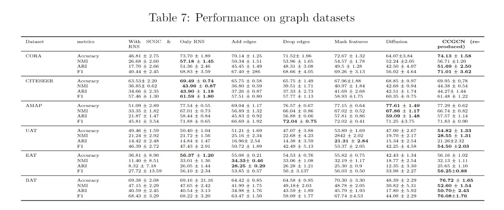

[stars-img]: https://img.shields.io/github/stars/sway-am/-Re-CCGC?color=yellow
[stars-url]: https://github.com/sway-am/-Re-CCGC/stargazers
[fork-img]: https://img.shields.io/github/forks/sway-am/-Re-CCGC?color=lightblue&label=fork
[fork-url]: https://github.com/sway-am/-Re-CCGC/network/members
[visitors-img]: https://visitor-badge.glitch.me/badge?page_id=sway-am.-Re-CCGC
[adgc-url]: https://github.com/sway-am/-Re-CCGC

# Cluster-guided Contrastive Graph Clustering Network

<p align="center">   
    <a href="https://pytorch.org/" alt="PyTorch">
      </a>
    <a href="https://aaai.org/Conferences/AAAI-23/" alt="Conference">
        </a>
<p/>


[![GitHub stars][stars-img]][stars-url]
[![GitHub forks][fork-img]][fork-url]
[![visitors][visitors-img]][adgc-url]


An official source code for paper [Re] Reproducibility Study : Cluster-guided Contrastive
 Graph Clustering Network. Any communications or issues are welcomed. Please contact prakhar.pratapsingh.cd.cse22@itbhu.ac.in. If you find this repository useful to your research or work, it is really appreciate to star this repository. :heart:

-------------

### Overview

<p align = "justify"> 
We propose a Cluster-guided Contrastive deep Graph Clustering network (CCGC) by mining the intrinsic supervision information in the high-confidence clustering results. Specifically, instead of conducting complex node or edge perturbation, we construct two views of the graph by designing special Siamese encoders whose weights are not shared between the sibling sub-networks. Then, guided by the high-confidence clustering information, we carefully select and construct the positive samples from the same high-confidence cluster in two views. Moreover, to construct semantic meaningful negative sample pairs, we regard the centers of different high-confidence clusters as negative samples, thus improving the discriminative capability and reliability of the constructed sample pairs. Lastly, we design an objective function to pull close the samples from the same cluster while pushing away those from other clusters by maximizing and minimizing the cross-view cosine similarity between positive and negative samples. Extensive experimental results on six datasets demonstrate the effectiveness of CCGC compared with the existing state-of-the-art algorithms.


<div  align="center">    
    
</div>

<div  align="center">    
    Figure 1: Overall framework of CCGC.
</div>


### Requirements

The proposed CCGC is implemented with python 3.7 on a NVIDIA 2080Ti GPU. 

Python package information is summarized in **requirements.txt**:

- torch==1.7.1
- tqdm==4.59.0
- numpy==1.19.2
- munkres==1.1.4
- scikit_learn==1.2.0


### Quick Start

python train.py


### Clustering Results

<div  align="center">    
    
</div>
<div  align="center">    
    Table 7: Clustering results of our ablation study  on six datasets.
</div>


<div  align="center">    
    
</div>


<div  align="center">    
    Figure 2: 2D <i>t</i>-SNE visualization of six methods on two datasets.
</div>


### Citation

If you find this project useful for your research, please cite your paper with the following BibTeX entry.

```
@inproceedings{CCGC,
  title={[Re] Reproducibility Study: Cluster-guided Contrastive Graph Clustering Network},
  author={Swayam Rajat Mohanty, Soumya Sharma, Prakhar Pratap Singh,En},
  booktitle={Proceedings of the AAAI conference on artificial intelligence},
  volume={37},
  number={9},
  pages={10834--10842},
  year={2023}
}
```
